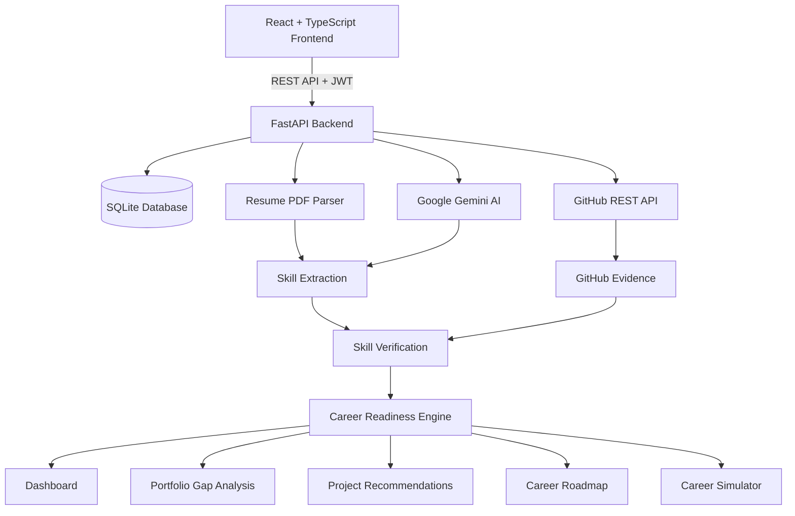

# careerlens-AI
# 🚀 CareerLens AI

### AI-Powered Career Readiness & Portfolio Verification Platform

**CareerLens AI** is an intelligent career-readiness platform that analyzes a student's **resume, GitHub portfolio, skills, and target career role** to determine how prepared they are for their desired job.

Instead of relying only on self-reported skills, CareerLens AI connects claimed skills with **real GitHub evidence**, analyzes portfolio quality, identifies skill gaps, generates personalized project recommendations, and creates a structured learning roadmap.

> **Know where you stand. Know what you're missing. Know what to build next.**

---

## 🎯 Problem

Students often struggle to answer:

* Am I actually ready for my target job?
* Are the skills on my resume supported by real projects?
* What skills am I missing?
* Is my GitHub portfolio strong enough?
* What projects should I build next?
* What should I learn first?

Traditional resume checkers mainly analyze keywords and formatting. They don't verify whether a candidate has actually demonstrated those skills through real work.

**CareerLens AI solves this by combining resume analysis, GitHub evidence, AI reasoning, portfolio analysis, and explainable scoring into one platform.**

---

## 💡 Our Solution

CareerLens AI creates a personalized career readiness profile by analyzing:

**Resume → Target Role → GitHub → Skills → Evidence → Portfolio → AI Analysis → Readiness Score → Roadmap**

The platform transforms this information into actionable recommendations instead of simply telling users what they are doing wrong.

---

## ✨ Key Features

### 📄 Resume Intelligence

* Upload and parse PDF resumes.
* Extract claimed technical skills.
* Analyze the candidate's experience and career direction.
* Compare resume skills with target-role requirements.

### 🎯 Career Readiness Score

CareerLens AI generates an explainable readiness score based on:

| Factor             | Weight |
| ------------------ | -----: |
| Skill Match        |    40% |
| Skill Verification |    20% |
| Role Relevance     |    20% |
| Portfolio Quality  |    10% |
| Activity           |    10% |

This makes the score more meaningful than a simple keyword-matching percentage.

### 🐙 GitHub Portfolio Verification

Connect a GitHub username and analyze:

* Public repositories
* Programming languages
* Repository activity
* Stars and forks
* README quality
* Repository topics
* Project evidence

The system compares claimed resume skills against actual GitHub evidence.

### 🧠 AI Skill Extraction

Google Gemini is used to intelligently extract and classify skills from resume information and analyze career requirements.

The platform also includes local fallback logic so parts of the system can continue working when an AI API key is unavailable.

### 🔍 Skill Verification

Skills are categorized based on available evidence:

* `CLAIMED_BUT_UNVERIFIED`
* `PARTIALLY_VERIFIED`
* `VERIFIED`

This helps distinguish between:

> "I know Python"

and

> "I have demonstrated Python through multiple projects."

### 📊 Portfolio Analysis

CareerLens AI identifies missing production-level portfolio elements such as:

* Database integration
* Deployment configuration
* Docker
* Cloud configuration
* Documentation
* Project structure
* Other production-readiness signals

### 🛠️ Personalized Project Recommendations

Instead of recommending random projects, the platform identifies missing skills and suggests **hands-on projects specifically designed to close those gaps**.

### 🗺️ Personalized Career Roadmap

Users receive a structured weekly learning roadmap containing:

* Skills to learn
* Milestones
* Recommended projects
* Progress-oriented tasks

### 🎮 Career Simulator

The interactive simulator allows users to experiment with their profile.

Users can select skills or improvements and instantly see how those changes could affect their readiness score.

This turns career planning into an interactive experience rather than a static report.

### 🌙 Modern Dashboard

The frontend includes:

* Responsive dashboard
* Interactive charts
* Skill matrices
* GitHub analytics
* Portfolio analysis
* Roadmaps
* Project recommendations
* Career simulator
* Light/dark theme support

---

# 🏗️ System Architecture



---

# 🧰 Tech Stack

## Frontend

* React 19
* TypeScript / TSX
* Vite
* Tailwind CSS
* Recharts
* Framer Motion
* Lucide React
* Vanilla CSS

## Backend

* Python
* FastAPI
* Uvicorn
* SQLAlchemy
* SQLite
* Pydantic
* PyPDF2
* Google Gemini API
* JWT Authentication
* bcrypt

## APIs & Integrations

* GitHub REST API
* Google Gemini API

---

# 📁 Project Structure

```text
careerlens-AI/
│
├── backend/
│   ├── app/
│   │   ├── api/
│   │   │   ├── auth.py
│   │   │   ├── profile.py
│   │   │   ├── resume.py
│   │   │   ├── github.py
│   │   │   ├── analysis.py
│   │   │   └── simulator.py
│   │   │
│   │   ├── ai/
│   │   │   └── ai_provider.py
│   │   │
│   │   ├── services/
│   │   │   ├── resume_service.py
│   │   │   ├── github_service.py
│   │   │   ├── skill_extraction_service.py
│   │   │   ├── skill_verification_service.py
│   │   │   ├── scoring_service.py
│   │   │   ├── recommendation_service.py
│   │   │   └── roadmap_service.py
│   │   │
│   │   ├── models/
│   │   ├── schemas/
│   │   ├── database/
│   │   ├── utils/
│   │   └── main.py
│   │
│   └── requirements.txt
│
├── frontend/
│   ├── src/
│   │   ├── components/
│   │   ├── context/
│   │   ├── views/
│   │   ├── App.tsx
│   │   ├── main.tsx
│   │   └── index.css
│   │
│   └── package.json
│
├── .gitignore
├── package.json
├── package-lock.json
├── codebase_guide.md
├── deploy_guide.md
└── README.md
```

---

# ⚙️ Getting Started

## 1. Clone the repository

```bash
git clone https://github.com/aaditya-kumar666/careerlens-AI.git
cd careerlens-AI
```

---

## 2. Backend Setup

Navigate to the backend:

```bash
cd backend
```

Create a virtual environment:

```bash
python -m venv venv
```

### Windows

```powershell
.\venv\Scripts\Activate.ps1
```

### macOS/Linux

```bash
source venv/bin/activate
```

Install dependencies:

```bash
pip install -r requirements.txt
```

---

## 3. Configure Environment Variables

Create a `.env` file inside the `backend` directory:

```env
GEMINI_API_KEY=your_gemini_api_key
JWT_SECRET=your_secure_jwt_secret
```

**Never commit your `.env` file or API keys to GitHub.**

---

## 4. Start the Backend

From the `backend` directory:

```bash
uvicorn app.main:app --host 127.0.0.1 --port 8000 --reload
```

Backend:

```text
http://127.0.0.1:8000
```

Swagger API documentation:

```text
http://127.0.0.1:8000/docs
```

---

## 5. Start the Frontend

Open another terminal:

```bash
cd frontend
```

Install dependencies:

```bash
npm install
```

Start the development server:

```bash
npm run dev
```

Frontend:

```text
http://localhost:5173
```

---

# 🔄 How CareerLens AI Works

```text
1. User selects a target career role
                ↓
2. User uploads resume
                ↓
3. AI extracts claimed skills
                ↓
4. User connects GitHub
                ↓
5. GitHub repositories are analyzed
                ↓
6. Skills are matched against evidence
                ↓
7. Portfolio quality is evaluated
                ↓
8. Career readiness score is calculated
                ↓
9. Missing skills are identified
                ↓
10. Personalized projects are recommended
                ↓
11. Weekly learning roadmap is generated
                ↓
12. User can simulate improvements
```

---

# 🧮 Explainable Scoring

CareerLens AI uses an explainable scoring model:

```text
Readiness Score =
    40% × Skill Match
  + 20% × Skill Verification
  + 20% × Role Relevance
  + 10% × Portfolio Quality
  + 10% × Activity
```

The goal is to provide users with an understandable explanation of **why** they received a particular score and **what actions can improve it**.

---

# 🧪 Demo Mode

CareerLens AI also supports a demo/offline experience.

Demo Mode can be used to showcase:

* Readiness scoring
* Career simulator
* Roadmaps
* Project recommendations
* Dashboard analytics

without requiring a complete backend connection.

---

# 🚀 Future Improvements

Potential future enhancements include:

* LinkedIn profile analysis
* Job-description-specific readiness scoring
* Live job-market skill trends
* Automated GitHub code-quality analysis
* Resume improvement suggestions
* ATS compatibility analysis
* Skill progression tracking
* More AI career agents
* Cloud database support
* Production deployment
* Multi-role comparison
* Internship recommendation engine

---

# 🏆 Why CareerLens AI?

Most career platforms tell students:

> **"Here are the skills you need."**

CareerLens AI aims to answer a more important question:

> **"Can you prove that you have those skills, and what should you do next to become job-ready?"**

By combining **AI + Resume Intelligence + GitHub Evidence + Explainable Scoring + Portfolio Analysis + Personalized Projects + Career Roadmaps**, CareerLens AI transforms career preparation into an actionable process.

---

# 👥 Team

Built for a hackathon by:

**Aditya Kumar**

GitHub:
https://github.com/aaditya-kumar666

---

# 📄 Documentation

For deeper technical information, see:

* [`codebase_guide.md`](./codebase_guide.md) — Architecture, modules, services, algorithms, and frontend/backend structure.
* [`deploy_guide.md`](./deploy_guide.md) — Local setup and deployment instructions.

---

# 📜 License

This project is currently intended for educational and hackathon purposes.
