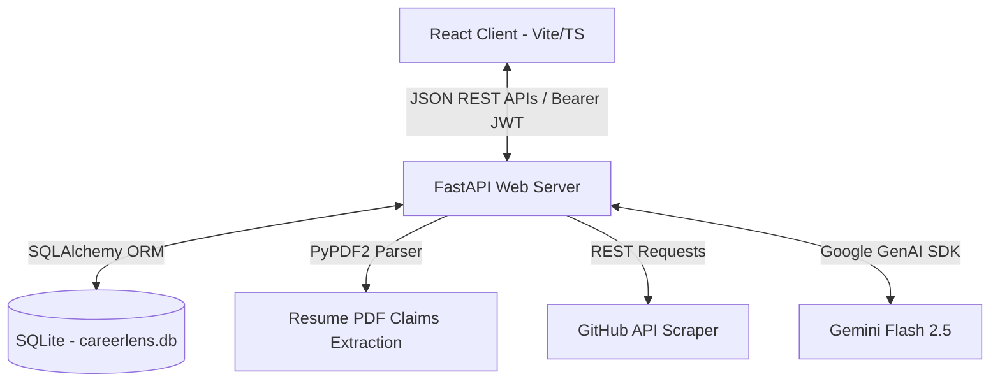

# CareerLens AI - Codebase & Module Reference Guide

This document maps the entire architecture, directory structure, language distribution, and functions of all modules in **CareerLens AI**. It is designed to help you explain the project structure, code files, and algorithms to hackathon judges.

---

## 1. Technology Stack & Languages

| Language | Folder | Purpose | Key Libraries Used |
| :--- | :--- | :--- | :--- |
| **Python** | `/backend` | Core logic, REST APIs, database queries, PDF reading, GitHub scraping, and Gemini AI integration. | FastAPI, Uvicorn, SQLAlchemy, PyPDF2, google-genai, passlib (with bcrypt 3.2.0 compatibility). |
| **TypeScript / TSX** | `/frontend` | Client-side reactive UI interface, global state management, simulation scoring, and dynamic routing. | React 19, Vite, Recharts, Framer Motion, Lucide React. |
| **CSS** | `/frontend/src` | Styling, premium layouts, scrollbars, and dynamic light/dark mode override mappings. | Vanilla CSS, Tailwind CSS v4. |
| **SQL (SQLite)** | `/backend` | Portable relational storage for user profiles, credentials, resume data, and repository verification items. | SQLite, SQLAlchemy ORM. |
| **HTML** | `/frontend` | Application skeleton mount page. | HTML5. |

---

## 2. System Architecture

---

## 3. Backend Module Directory (Python)

All backend code is located in the `/backend/app` folder.

### Core App & Database
*   **[main.py](file:///c:/hackathon/backend/app/main.py)**: The application entry point. Creates SQLite database tables on startup, registers CORS middlewares (allowing credentialed headers from localhost ports), and mounts all API routers.
*   **[database/connection.py](file:///c:/hackathon/backend/app/database/connection.py)**: Sets up the SQLAlchemy database engine using the SQLite connection string (`sqlite:///./careerlens.db`) and provides a transactional session manager (`get_db`) to inject database sessions into requests.
*   **[models/models.py](file:///c:/hackathon/backend/app/models/models.py)**: Defines the relational database schemas. Includes mapping models for `User` (hashed passwords), `CareerProfile` (target roles), `Resume` (text), `GitHubProfile`, `Repository`, `UserSkill`, `SkillEvidence`, `CareerAnalysis` (metrics), `PortfolioAnalysis` (gaps), `Recommendation` (projects), and `Roadmap` (week-by-week cards).
*   **[schemas/schemas.py](file:///c:/hackathon/backend/app/schemas/schemas.py)**: Declares Pydantic data schemas for request payloads, authentication inputs, and structured JSON responses.

### Services & Algorithms
*   **[utils/auth.py](file:///c:/hackathon/backend/app/utils/auth.py)**: Handles authentication security. Configures JWT token signing (HS256) and decoding, password encryption, and injects a custom `bcrypt` package compatibility patch to support stable credentials checks.
*   **[services/resume_service.py](file:///c:/hackathon/backend/app/services/resume_service.py)**: Uses the `PyPDF2` package to parse raw PDF binaries uploaded by users and returns the plain text body.
*   **[services/github_service.py](file:///c:/hackathon/backend/app/services/github_service.py)**: Queries public repositories, stars, forks, primary languages, custom topics, and readme text from the GitHub REST API. If the API is rate-limited, it automatically catches the code and injects realistic developer templates to avoid crashes.
*   **[services/skill_extraction_service.py](file:///c:/hackathon/backend/app/services/skill_extraction_service.py)**: Extracts a list of claimed technologies from the resume text using Gemini AI or local fallback patterns and inserts them into the database as `CLAIMED_BUT_UNVERIFIED`.
*   **[services/skill_verification_service.py](file:///c:/hackathon/backend/app/services/skill_verification_service.py)**: Scans your repositories for language matches or keyword mentions. Updates claimed skills to `VERIFIED` (if high-confidence proof exists in multiple repos) or `PARTIALLY_VERIFIED` (if low-confidence proof is found in readme/topics).
*   **[services/scoring_service.py](file:///c:/hackathon/backend/app/services/scoring_service.py)**: Implements the explainable Readiness Score formula:
    $$\text{Readiness} = (40\% \times \text{Skill Match}) + (20\% \times \text{Verification}) + (20\% \times \text{Relevance}) + (10\% \times \text{Quality}) + (10\% \times \text{Activity})$$
    Also formats data for radar charts and queries portfolio gap analyses.
*   **[services/recommendation_service.py](file:///c:/hackathon/backend/app/services/recommendation_service.py)**: Suggests specific hands-on developer projects to complete based on detected missing required skills.
*   **[services/roadmap_service.py](file:///c:/hackathon/backend/app/services/roadmap_service.py)**: Compiles a weekly learning timeline with concrete milestones to guide the user to job readiness.
*   **[ai/ai_provider.py](file:///c:/hackathon/backend/app/ai/ai_provider.py)**: Integrates the Google Gemini API. Handles role skill parsing and portfolio gap analyses. Contains a local taxonomy backup system to run offline if no API key is set.

### API Routes
*   **[api/auth.py](file:///c:/hackathon/backend/app/api/auth.py)**: `/auth/register` (user creation) and `/auth/login` (JWT token generation).
*   **[api/profile.py](file:///c:/hackathon/backend/app/api/profile.py)**: `/profile` (get current setup) and `/profile/setup` (create target role and job details).
*   **[api/resume.py](file:///c:/hackathon/backend/app/api/resume.py)**: `/resume/upload` (accepts PDF files and triggers text extraction).
*   **[api/github.py](file:///c:/hackathon/backend/app/api/github.py)**: `/github/connect` (fetches repositories and links username).
*   **[api/analysis.py](file:///c:/hackathon/backend/app/api/analysis.py)**: `/analysis/start` (combines all service processors) and `/analysis/latest` (serves the dashboard payload).
*   **[api/simulator.py](file:///c:/hackathon/backend/app/api/simulator.py)**: `/simulator` (predicts score changes dynamically).

---

## 4. Frontend Module Directory (Vite, TSX, CSS)

All frontend source code is located in the `/frontend/src` folder.

### Core Entry & State
*   **[main.tsx](file:///c:/hackathon/frontend/src/main.tsx)**: App loader. Features an asynchronous dynamic loader that intercepts package-loading exceptions and logs them cleanly.
*   **[App.tsx](file:///c:/hackathon/frontend/src/App.tsx)**: Renders a Class-based diagnostic **Error Boundary** overlay and controls routing.
*   **[context/AppContext.tsx](file:///c:/hackathon/frontend/src/context/AppContext.tsx)**: The main state engine. Manages authorization headers, loads preferences, caches results, and runs a client-side simulation engine to support instantaneous scoring updates in **Demo Mode**.
*   **[index.css](file:///c:/hackathon/frontend/src/index.css)**: Implements custom Tailwind v4 `@theme` properties. Includes context-driven styling overrides that intercept and remap dark tailwind classes into a light theme layout when the `.dark` class is missing.

### Views & Panels
*   **[views/LandingPage.tsx](file:///c:/hackathon/frontend/src/views/LandingPage.tsx)**: The home screen. Features feature grids, call-to-action buttons, theme toggle links, and demo mode shortcuts.
*   **[views/AuthPage.tsx](file:///c:/hackathon/frontend/src/views/AuthPage.tsx)**: Split-pane authentication form.
*   **[views/OnboardingPage.tsx](file:///c:/hackathon/frontend/src/views/OnboardingPage.tsx)**: Guided wizard. Collects target role information, uploads the PDF, binds the GitHub handle, and showcases a step-by-step scanner experience.
*   **[views/DashboardPage.tsx](file:///c:/hackathon/frontend/src/views/DashboardPage.tsx)**: Features circular SVG gauges, Recharts Radar charts, and summary panels.
*   **[views/SkillsPage.tsx](file:///c:/hackathon/frontend/src/views/SkillsPage.tsx)**: Grid matrix categorizing skills by category and matching evidence cards.
*   **[views/GithubPage.tsx](file:///c:/hackathon/frontend/src/views/GithubPage.tsx)**: Repository activity cards, primary languages list, and README quality flags.
*   **[views/PortfolioPage.tsx](file:///c:/hackathon/frontend/src/views/PortfolioPage.tsx)**: Checklist verifying production elements (e.g. database schemas, Dockerfiles, cloud configurations).
*   **[views/RoadmapPage.tsx](file:///c:/hackathon/frontend/src/views/RoadmapPage.tsx)**: Step-by-step weekly learning pathway.
*   **[views/ProjectsPage.tsx](file:///c:/hackathon/frontend/src/views/ProjectsPage.tsx)**: Detailed project specifications boards with milestones.
*   **[views/SimulatorPage.tsx](file:///c:/hackathon/frontend/src/views/SimulatorPage.tsx)**: Interactive workspace with skill check-boxes that recalculate readiness scores instantly.
*   **[views/SettingsPage.tsx](file:///c:/hackathon/frontend/src/views/SettingsPage.tsx)**: Reconfigure target role parameters.
*   **[components/DashboardLayout.tsx](file:///c:/hackathon/frontend/src/components/DashboardLayout.tsx)**: Responsive sidebar shell providing page-switching and light/dark theme toggle triggers.
