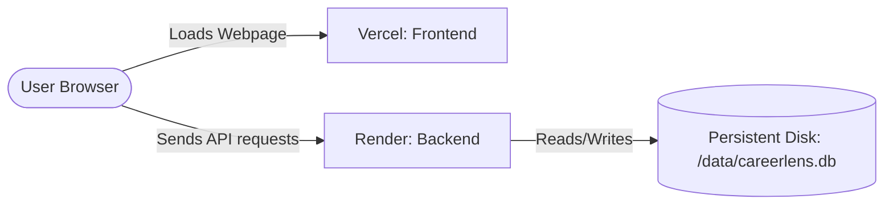

# CareerLens AI - Full-Stack Deployment Guide

This guide explains how to host your complete full-stack **CareerLens AI** application in the cloud for free using **Render** (for the Python FastAPI + SQLite backend) and **Vercel** (for the React/Vite frontend) connected directly to your GitHub repository.

---

## Deployment Architecture



---

## Phase 1: Deploying the Backend on Render
We use Render because it offers a free tier for Python Web Services and supports **Persistent Disks**, which is required to prevent your SQLite database (`careerlens.db`) from getting deleted between deploys.

### Step 1: Create a Render Account
1.  Go to [Render.com](https://render.com/) and sign up (linking your GitHub account is easiest).
2.  Agree to the terms and open your dashboard.

### Step 2: Create a New Web Service
1.  On the Render Dashboard, click the **New +** button and select **Web Service**.
2.  Choose **Build and deploy from a Git repository**.
3.  Select your repository: `aaditya-kumar666/careerlens-AI`.

### Step 3: Configure Build & Start Commands
Fill in the deployment details exactly as follows:
*   **Name**: `careerlens-api`
*   **Region**: Select the region closest to you.
*   **Branch**: `main`
*   **Language**: `Python`
*   **Build Command**: 
    ```bash
    pip install -r backend/requirements.txt
    ```
*   **Start Command**:
    ```bash
    cd backend && uvicorn app.main:app --host 0.0.0.0 --port $PORT
    ```
*   **Instance Type**: `Free`

### Step 4: Add a Persistent Storage Disk
1.  Scroll down to the bottom of the page and click **Advanced**.
2.  Find the **Disks** section and click **Add Disk**.
3.  Set the parameters:
    *   **Name**: `sqlite_storage`
    *   **Mount Path**: `/data`
    *   **Size**: `1 GB` (free).

### Step 5: Configure Environment Variables
In the **Environment Variables** section, click **Add Env Variable** and declare these parameters:
1.  **`DATABASE_URL`**: `sqlite:////data/careerlens.db`
    *(This tells SQLAlchemy to write and save your database inside the persistent `/data` disk folder so it never gets wiped out).*
2.  **`JWT_SECRET`**: `(Type a long random string of letters and numbers here)`
    *(Used to encrypt session tokens secure-hashing logins).*
3.  **`YOUTUBE_API_KEY`**: `(Optional: your Google Developer Console Youtube API key)`
    *(Enables live search replacements for broken videos).*

### Step 6: Deploy
1.  Click **Create Web Service**.
2.  Wait for the build logs to finish. Once completed, your backend will show `Live`.
3.  Copy your backend URL from the top of the Render page (e.g. `https://careerlens-api.onrender.com`).

---

## Phase 2: Deploying the Frontend on Vercel
Vercel is optimized for building and serving lightning-fast React applications from GitHub.

### Step 1: Create a Vercel Account
1.  Go to [Vercel.com](https://vercel.com/) and sign up using your GitHub account.

### Step 2: Import Your Repository
1.  On the Vercel dashboard, click **Add New** → **Project**.
2.  Find your `careerlens-AI` repository and click **Import**.

### Step 3: Configure Root & Build Folders
1.  In the configuration page, click edit next to **Root Directory** and select the **`frontend`** folder.
2.  Under **Build and Development Settings**, verify the settings (Vite is auto-detected):
    *   **Framework Preset**: `Vite`
    *   **Build Command**: `npm run build`
    *   **Output Directory**: `dist`

### Step 4: Add Environment Variables
Expand the **Environment Variables** section and add:
*   **Key**: `VITE_API_URL`
*   **Value**: `https://careerlens-api.onrender.com`
    *(Paste the exact Render backend URL you copied from Phase 1, making sure there is no trailing slash `/` at the end).*

### Step 5: Click Deploy
1.  Click **Deploy**.
2.  Vercel will compile your TypeScript React code and host your site on a secure `https://...vercel.app` domain.

---

## Verification & Testing

Once both systems are live:
1.  Open your Vercel URL in your browser.
2.  Go to the register page and create a new account (this will verify frontend-to-backend API communication).
3.  Configure your target role and complete onboarding.
4.  Navigate to the **Career Roadmap** and verify that all recommended learning resources, fallback rankings, and custom timeline progress states operate regression-free in the cloud!
